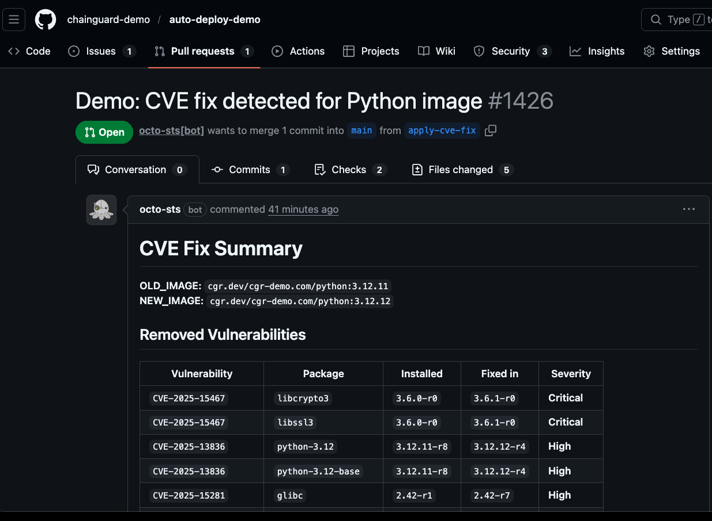

## CVE Fix and Auto-Deploy Demo

This demo walks through a full software supply chain flow:

1.  Build an image with an outdated OpenSSL (contains Critical CVEs) in Python 3.12
2.	Scan the image and detect vulnerabilities
3.	Attempt deployment → blocked by Kyverno
4.	Rebuild with patched base image
5.	Sign the image with Cosign
6.	Attach vulnerability attestation
7.	Deploy again → admitted by policy

### updates.yaml 

Steps (in order):

1) Harden the runner (Audit all outbound calls)
2) Checkout repository
3) Setup Go environment
4) Mint GitHub token for PR creation (Octo STS)
5) Install Crane
6) Install Grype (pinned) [conditional: SCAN_WITH_GRYPE == 'true']
7) Install Cosign
8) Install chainctl
9) Auth to Registry (Chainguard)
10) Set OLD_IMAGE / NEW_IMAGE from env
11) Cosign verify new image signature
12) Run chainctl images diff + build PR summary
   • Prints first 200 lines of PR_BODY.md
13) Rebuild PR body using Grype comparison (adds package/fix info)
14) Scan new image with Grype + append summary
15) Upload Grype SARIF results
16) Pre-pull docker image for Prisma Cloud scan
17) Prisma Cloud image scan
18) Upload Prisma Cloud SARIF file
19) Extract Prisma Cloud Console Link
20) Append Prisma link to PR body
21) Write CVE resolution results to repo (force a diff)
22) Create Pull Request
   [conditional: FIX_CVE == 'true']
   • peter-evans/create-pull-request (pinned SHA)
   • Uses token from octo-sts step
   • commit-message: "Demo: record CVE fix results"
   • title: "Demo: CVE fix detected for Python image"
   • body-path: PR_BODY.md
   • labels: automated pr, cve, patch
   • branch: apply-cve-fix
   • delete-branch: true

### deploy-main.yaml

Trigger: pull_request closed

#### Job 1: push-image (runs only if PR merged AND head.ref == apply-cve-fix)

1) Checkout repo — actions/checkout@v4
2) Setup Go — actions/setup-go (cache: false)
3) Configure AWS credentials (OIDC) — aws-actions/configure-aws-credentials@v4
4) Login to ECR — aws-actions/amazon-ecr-login@v2
5) Install crane — go install crane@latest; add $HOME/go/bin to PATH; crane version
6) Install Cosign — sigstore/cosign-installer
7) Install Grype (pinned) — download/install v0.91.2; grype version
8) Setup chainctl — chainguard-dev/setup-chainctl
9) Auth to Chainguard registry — chainctl auth configure-docker
10) Read source image from repo — cat demo-results/new-image.txt -> SRC
11) Copy SRC to ECR + compute digest-pinned ref
    - crane copy SRC <ecr>/<repo>:<github.sha>
    - crane digest <ecr>/<repo>:<github.sha>
    - output image=<ecr>/<repo>@sha256:<digest>
12) Keyless sign ECR image — cosign sign --yes <digest-pinned-image> (COSIGN_EXPERIMENTAL=1)
13) Attest vulnerability predicate — grype <image> -o json; jq -> vuln-predicate.json; cosign attest --predicate vuln-predicate.json <image>

#### Job 2: deploy (needs push-image; runs only if push-image succeeded)

1) Checkout repo — actions/checkout@v4
2) Configure AWS credentials (OIDC) — aws-actions/configure-aws-credentials@v4
3) Install kubectl — azure/setup-kubectl@v4 (v1.33.0)
4) Update kubeconfig — aws eks update-kubeconfig --region AWS_REGION --name EKS_CLUSTER_NAME; kubectl cluster-info
5) Ensure namespace exists — kubectl get namespace NAMESPACE || kubectl create namespace NAMESPACE
6) Apply base manifest — kubectl apply -n NAMESPACE -f services/python-web/deployment.yaml
7) Patch deployment image to digest + rollout
   - kubectl set image -n NAMESPACE deployment/APP_NAME APP_NAME=<needs.push-image.outputs.image>
   - kubectl rollout status -n NAMESPACE deployment/APP_NAME --timeout=10m